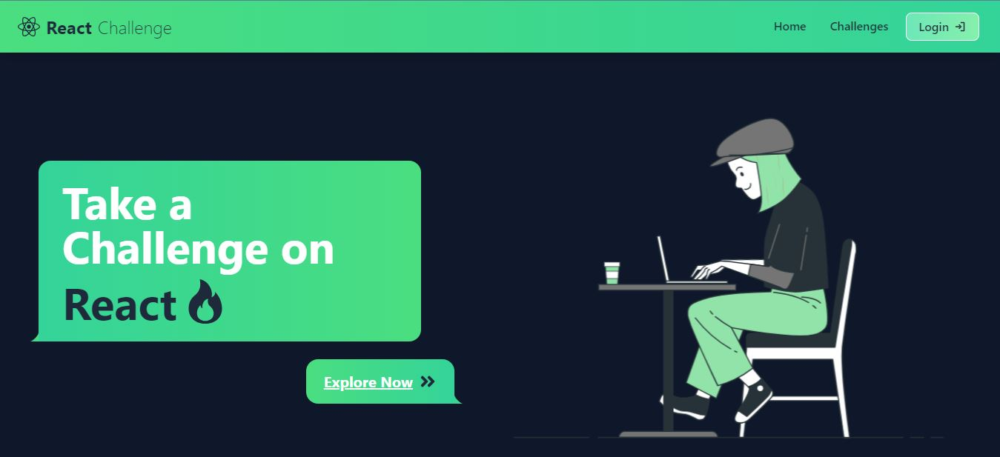

    
    

<a href="https://react-challenge-1e086.web.app/" target="_blank">
        React Challenge
    </a>

<h3 align="center">Take a Challenge on React? 👉 <a href="https://react-challenge-1e086.web.app/" target="_blank">
       Explore Now 
    </a></h3>

# 👋 Introducing `React Challenge`

    

`React Challenge` is an platform to take challenge on `React` using a simple, easy-to-use interface. You can take challenge as your level.

# 🚀 Use React Challenge

Please access `React Challenge` using the URL:

> https://react-challenge-1e086.web.app/

# 🔥 Features

`React Challenge` comes with a bundle of features already. You can do the followings with it,

## 🎯 Take Challenge

- Take challenges on `React` with different react core concepts as your prefer level.

## 🏗️ Challenge Category

- You can find challenges based on categories, like `useState`, `useEffect`,`Router`,`Debugging` such kind of react core concepts as a category.

## 📢 Challenge Level

- There are three kind level such as `Easy`,`Medium`,`Advance`. Take challenges to level up your react concepts.

## 💻 Live Code Editor

- This is one of the key feature of this platform. You get a live code editor which have `Live preview`,`Console`, and most amazing `Test` feature.

## 📌 Save Challenges

- You can save any challenge with your current progress.
- Can back to the previous challenge with previous progress.

## 🔍 Search Challenges

- Search a challenges Title, Category or Level.

## 🎿 Filter Challenges

- Filter challenges by Category or Level.

## 🔑 Authentication & Authorization

- Features like save challenge need you to authenticate with the app. You can use your Gmail credentials to authenticate to the app or continue with google account. It is secured and powered by `Firebase`.

## 📱 Responsive and mobile-friendly

- Use `React Challenge` seamlessly from any device.

# 🍔 Built With

- [React Js](https://react.dev/): The coolest Javascript framework
- [Mongo DB](https://harperdb.io/https://www.mongodb.com/): A flexible Data Store
- [Node.Js](https://nodejs.org/en): Powerful Javascript runtime.
- [Express.Js](http://expressjs.com/): A easier and simple Node.Js library
- [Codesandbox/sandpack-react](https://sandpack.codesandbox.io/): Run any JavaScript and Node.js app in any browser.
- [monaco-editor/react](https://www.npmjs.com/package/@monaco-editor/react): The Monaco Editor is the code editor that powers VS Code.
- [Tailwind](https://tailwindcss.com/): A popular css framework
- [daisyUI](https://daisyui.com/): An amazing Tailwind based component library
- [react-icons](https://react-icons.github.io/react-icons/): One shop for all the icons
- [react-toastify](https://www.npmjs.com/package/react-toastify): Super cool toast messages
- [Firebase](https://firebase.google.com/): Authentication services and Frontend hoisting
- [Vercel](http://vercel.com/): Amazing platform for hoisting

# ✨ Upcoming Features

`React Challenge` has all the potentials to grow further. Here are some of the upcoming features planned(not in any order),

- ✔️ Integrate dynamic file system with the code editor
- ✔️ Manage challenge category dynamically
- ✔️ Add sub-category based challenge
- ✔️ Collaborate with others
- ✔️ Live chat
- ✔️ Flexible Datastore
- ✔️ Better Performance
- ✔️ More authentication mechanisms like twitter, facebook, github etc.

# 🤝 Support

We all need support and motivation. `React Challenge` is not an exception. Please give this project a ⭐️ to encourage and show that you liked it. Don't forget to leave a star ⭐️ before you move away.
